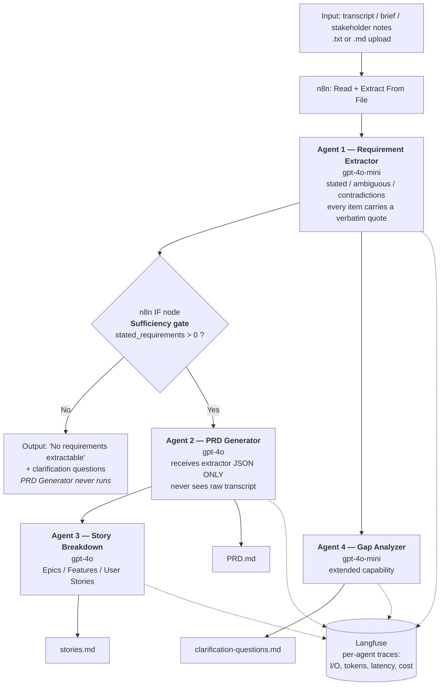

# PRD Genie — Design (Playbook Steps 1–3)

**Author:** Shailendra Parolkar · **Platform:** n8n · **Extended capability:** Gap Analysis · **Observability:** Langfuse

Everything here feeds directly into the Q3 writeup. Section numbers map to the playbook steps.

---

## Step 1 — Problem summary

*(Use these three sentences to open the Q3 writeup.)*

> PMs and TPMs at NeuronForge lose hours translating meeting transcripts and stakeholder notes into structured PRDs, and because every PM formats them differently, engineering estimation slows down and requirements get lost in documents nobody revisits. PRD Genie ingests a transcript, brief, or set of notes and produces a template-conformant PRD, epics, and user stories, along with the clarification questions needed to close what the meeting left open. The dominant risk is fabrication: a PRD that reads authoritatively but contains a requirement nobody stated is worse than no PRD at all, because downstream engineering will build to it.

**Why the risk framing matters.** Six of the twelve baseline tests (T2, T3, T5, T6, T9, T10) grade the system on *correctly refusing* — flagging ambiguity, surfacing contradictions, declining to generate. Nine of the twelve carry an explicit "Must NOT" clause. Half of this project's score is the system knowing what it doesn't know, so groundedness is not one design concern among several; it is the design.

---

## Step 2 — Tool selection

| Category | Choice | Why |
|---|---|---|
| Workflow platform | **n8n** | Used it in class, so build time goes into prompt design rather than fighting an unfamiliar tool. PRD Genie has no external API surface — inputs are uploaded files, output is markdown — so no platform has a native-integration advantage here. What n8n does buy is its IF node, which implements the extraction sufficiency gate (§3.4) as visible workflow structure rather than buried prompt logic — a grader can see the guardrail on the canvas. |
| LLM — extraction | **gpt-4o-mini** | Extraction is span-finding and classification against a fixed schema, not open generation. Transcripts are the largest input in the pipeline and this agent reads all of them, so the cheap model runs where token volume is highest. |
| LLM — PRD + stories | **gpt-4o** (or Claude) | These agents must hold a 10-section template and a requirements set in mind simultaneously and resist filling gaps — careful long-form reasoning, and the output is the graded artifact. |
| Document ingestion | n8n Read Binary File → Extract From File | Inputs are `.txt` and `.md`. No OCR, no parsing complexity. |
| Observability | **Langfuse** | Set up in class. Connect it before building agent 2, not after — the per-agent traces are what let you attribute a hallucination to the extractor vs. the generator, and Q4 asks explicitly for trace findings. |
| Output | Markdown to file | Matches `prd_template.md`; renders in GitHub for the submission repo. |
| Auth | None required | Local file upload, no OAuth. State this explicitly in the writeup rather than leaving the row blank — a blank reads as an oversight, an explicit "not needed, and here's why" reads as a decision. |

**Mixed-model rationale to use in the writeup:** the extractor sees every token of every transcript but produces short structured output; the generator sees a compact requirements object but produces the long graded document. Putting the cheap model where the input volume is and the strong model where the output quality is graded is the argument — and it holds up better than a generic "mini is cheaper."

---

## Step 3 — Agent system design

### 3.1 The core design tension

Read `prd_template.md` against the test inputs and the problem becomes concrete. The template demands ten sections: Success Metrics (2–3 KPIs), User Personas with "Current Workaround," NFR targets, Out of Scope, Dependencies with owner and risk, Assumptions, Open Questions, and a Timeline with four dated milestones.

Now look at T1, your richest test input:

> "The user should be able to filter reports by date range, category, and status. Results must load in under 2 seconds. PM: Sarah. Deadline: Q3."

That supports maybe three of the ten sections. Nothing in it states a success metric, a persona's current workaround, or a design-complete date. So the PRD Generator faces seven empty sections it has been told to fill — and filling them *looks like doing the job well*. The model isn't being creative; it's being obedient to a template.

This is why "don't hallucinate" in the prompt does almost nothing here. The template is a stronger instruction than the warning. The fix has to be structural.

### 3.2 Tasks, and which ones become agents

| Task | Agent? | Reasoning |
|---|---|---|
| Parse input (transcript / brief / notes) | No — n8n node | Deterministic file read. No judgment, no reason to pay a model. |
| Extract requirements, classify stated vs. ambiguous vs. contradictory, capture stakeholders/deadlines/constraints | **Agent 1** | One artifact in, one classification pass. Splitting "extract" from "classify" would make a second model re-read the same transcript for no gain. |
| Decide whether there's enough to proceed | No — n8n IF node | A count check (`stated_requirements.length > 0`). Deterministic, and visible on the canvas. |
| Generate PRD against template | **Agent 2** | Different job, different failure mode, and the one place the template-filling pressure lives. |
| Break into epics / features / user stories | **Agent 3** | Different output shape, different guardrail (inflation — five requirements becoming eleven stories). |
| Produce clarification questions from gaps | **Agent 4** (extended capability) | Different consumer: this output goes back to stakeholders, not into the PRD. |
| Write output files | No — n8n node | Deterministic. |

**Four agents, three non-agent nodes.** Say that split out loud in the writeup — showing where you deliberately *didn't* put an LLM demonstrates the judgment the Design sub-criterion (10 pts) is grading. Learners lose points for over-splitting far more often than under-splitting.

### 3.3 Orchestration pattern — sequential pipeline

**Justification (writeup-ready):**

> I selected a sequential pipeline because every input to PRD Genie is the same kind of object — one body of meeting text — and each must pass through the same stages in the same fixed order: extract requirements, generate the PRD, break it into stories. The stages are strictly data-dependent: the PRD Generator cannot run before requirements exist, and the Story Breakdown agent cannot run before there is a feature list to decompose. A router/dispatcher would spend a classification call deciding a route that is already known at design time, since a transcript, a brief, and stakeholder notes all need identical treatment — text in, requirements out. A hierarchical planner would decompose a workflow whose decomposition is fixed before any input arrives. When the dependency graph is a straight line, the pattern that matches it is a pipeline. The one deviation is the Gap Analyzer, which branches off the extractor's output in parallel with PRD generation rather than sitting downstream of it, because clarification questions are derived from what the *extraction* found missing, not from what the PRD contains.

The self-test: if your justification sentence would still be true for someone else's capstone, it isn't specific enough yet. The data-dependency clause above is what makes this one specific.

### 3.4 The two structural guardrails

These matter more than any prompt wording, and they're what will separate this submission from the median.

**Guardrail A — the PRD Generator never sees the raw transcript.**

It receives only the extractor's JSON: requirements, each carrying a verbatim quote and a speaker. If it never has the transcript, it has no raw material to "helpfully infer" from. Fabrication becomes architecturally unreachable rather than merely discouraged. In n8n this is just node wiring — Agent 2's input is Agent 1's output, not the original file.

**Guardrail B — the sufficiency gate.**

An IF node between extraction and PRD generation:

```
IF  stated_requirements.length == 0
    → emit "No requirements extractable from this input." + the Gap Analyzer's questions
    → STOP. Do not invoke the PRD Generator.
ELSE
    → proceed
```

This is what passes T9 ("Meeting happened. Notes: none.") cleanly, and it passes it *by construction* rather than by hoping the model declines. T5 likely lands here too. A grader can see this node on your canvas — that's 10-point Design credit you can point at.

**The traceability affordance you already have.** `prd_template.md` §4.1 includes a **Source** column. Use it: every FR row cites the requirement ID it came from, and every requirement ID carries a verbatim quote from the extractor. Hallucination then becomes *detectable by inspection* — any row with an empty or invented Source is an unsupported requirement. This turns your hallucination-rate metric from a hand-judged count into something you can check mechanically, and it uses a column the template already asked for.

### 3.5 Agent specifications

| Agent | Single responsibility | Input (from) | Output | Model | Key guardrail |
|---|---|---|---|---|---|
| **1. Requirement Extractor** | Classify every requirement-bearing statement in the input | Raw text (file node) | JSON: `stated[]`, `ambiguous[]`, `contradictions[]`, `stakeholders[]`, `personas[]`, `constraints[]`, `dependencies[]`, `not_discussed[]` — every item with a verbatim quote | gpt-4o-mini | Every item must carry a verbatim quote. No quote, no item. Discussion without a decision goes to `ambiguous`, never to `stated`. |
| **2. PRD Generator** | Populate the 10-section template from extracted requirements | Agent 1 JSON **only** | Markdown PRD following `prd_template.md`, Source column populated | gpt-4o | Any section without supporting entries gets the literal string `Not discussed in this meeting.` — nothing else. No placeholders, no "TBD — recommend tracking X." |
| **3. Story Breakdown** | Convert PRD features into epics and user stories | Agent 2's FR/AC sections | Epics → Features → User Stories, `As a [persona], I want [x], so that [y]`, MoSCoW priority | gpt-4o | One story per requirement unless the requirement names multiple actors. Priority must come from stated urgency; absent that, `Priority: Not stated`. |
| **4. Gap Analyzer** | Turn gaps into stakeholder questions | Agent 1's `ambiguous`, `contradictions`, `not_discussed` | Numbered clarification questions, each naming who should answer | gpt-4o-mini | Questions only. Never proposes the answer. "What load time is acceptable?" not "Should we target 3 seconds?" |

The guardrail column is the one learners skip and the one that decides your test results. Full prompts are in `02-agent-prompts.md`.

### 3.6 Architecture diagram



Paste this into GitHub and it renders. For the slide deck, export it as PNG from mermaid.live.

---

## What Step 4 looks like

Build **Agent 1 alone**, on T1, and confirm it separates the four stated requirements (date/category/status filters, 2-second load, Sarah as PM owner, Q3 deadline) from the one genuinely ambiguous item — "TBD on that" about the data source, which appears in the full Transcript 1 but not the condensed T1 test input.

Then, before building anything else, run **T9** through that same single agent. If it returns empty lists, the extractor is behaving. If it invents anything, fix that now — every downstream agent inherits the extractor's output, so a fabrication here contaminates everything after it.

One thing to notice about your test data: the `eval_prdgenie_inputs.txt` entries are one-to-three sentence condensations, while `sample_meeting_transcripts.txt` holds the full multi-turn conversations. Your pipeline has to handle both. Test with the short ones (they're what the TA runs) but demo with the full transcripts — they're far more impressive in the video, and the length difference is also what makes your cost estimate realistic.

**A note on T4:** the condensed test input says "CSV must preserve formulas," while the full transcript resolves this to XLSX with a CSV-labeled button. The expected output says extract acceptance criteria *verbatim* and add nothing. If your extractor pulls the XLSX resolution into a test run of the short T4 input, that's a hallucination — it came from your knowledge of the other file, not the input. Good trap to watch for.
